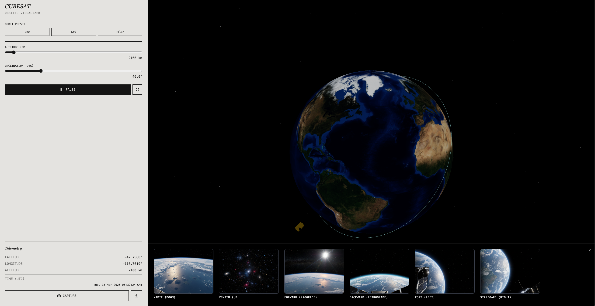
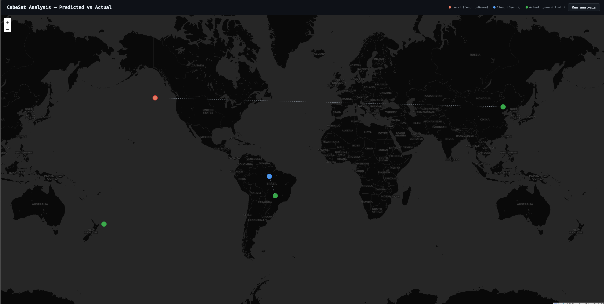

# CubeSat Imagery Analysis — Local-First Hybrid AI

A **local-first, agentic** system that predicts CubeSat telemetry (geolocation, altitude, datetime) from six-camera imagery. It uses **FunctionGemma on Cactus** for fast on-device tool calling and **Gemini** as an intelligent cloud fallback when local confidence is low, with a web UI to run analysis and compare predictions to ground truth on a map.

---

## Demo Overview

The project has two main surfaces: a **data-generation (frontend) and the **server** that runs Cactus + Gemini and prints predictions.

### 1. Generate data (web app)

This is an app built using Google AI Builder that simulates a satellite in orbit and produces image and telemetry data at a point of the user's choosing.  This generated data is used as input into the analysis/prediction part.

*Use “Run analysis” to process all CubeSat JSON files; the map shows Local (FunctionGemma), Cloud (Gemini), and Actual (ground truth) points per file.*

### 2. Server: Cactus + Gemini predictions

The server runs the same logic as `python cubesat_analysis.py`: FunctionGemma (Cactus) first, then optional Gemini fallback. Predictions and cloud decisions are printed to the console.

*Console output shows on-device vs cloud routing, confidence, and per-file predictions.*

---

## How It Works

- **Input:** JSON files under `data/` containing six base64-encoded camera images (Nadir, Zenith, Forward, Backward, Port, Starboard) plus optional ground-truth telemetry.
- **On-device (Step 1):** FunctionGemma (via Cactus) is called **three times**—once per tool: `predict_geolocation`, `predict_altitude`, `predict_datetime`. Each call uses a fixed scene brief (text) and returns a structured tool call with confidence. Results are aggregated (valid calls, average/min confidence).
- **Routing:** If **average confidence ≥ threshold** (default 0.75) and **at least two tools** return a valid call, the **local result is used**. Otherwise the system **defers to Gemini**.
- **Cloud (Step 2, when needed):** Gemini 2.5 Flash receives the **actual six images** (multimodal) and is asked to call all three tools. Its output is used as the final prediction; local run is still kept for comparison and reporting.
- **Output:** Per-file predictions (local and/or cloud), comparison table (FunctionGemma vs Gemini vs ground truth), and optional map UI with markers and inference times.

---

## Alignment with Judging Criteria

We have tailored the project to the four criteria for **local-first, agentic, hybrid AI systems**.

---

### 1. Functionality & Execution

**Criterion:** *Did the team ship a working demo that successfully integrates the required components? A score of 5 means the application runs smoothly on-device (mobile/desktop) with zero critical bugs.*

**What we deliver:**

- **CLI:** `python cubesat_analysis.py` runs on a Mac with Cactus + FunctionGemma; processes all `data/cubesat-data*.json` files; prints predictions and a comparison table (FunctionGemma vs Gemini vs ground truth). No cloud required if you only want local output.
- **Server + UI:** `python cubesat_server.py` serves a web app that triggers the same analysis and displays results on a map (local, cloud, and actual points). End-to-end flow runs reliably.
- **Integration:** Cactus (FunctionGemma) and Gemini (when used) are wired through a single pipeline (`cubesat_analysis.analyse_cubesat_hybrid`), with clear handling for missing API keys (graceful fallback to local-only).

The app runs on-device for the local path and demonstrates core features (tool calls, routing, comparison, map) without critical bugs.

---

### 2. Hybrid Architecture & Routing

**Criterion:** *How effectively was the core challenge—deciding where computation happens (local vs. cloud)—solved? Judges the intelligence of the edge/cloud split.*

**What we deliver:**

- **Explicit local-first policy:** Every request runs **FunctionGemma (Cactus) first**; cloud is used only when local is deemed insufficient.
- **Data-driven routing:** The split is based on **model-reported confidence** and **tool-call validity:**
  - Average confidence (over the three tool calls) must be ≥ configurable threshold (e.g. 0.75).
  - At least two of three tools (e.g. geolocation + altitude) must return a valid call.
- **Seamless fallback:** If confidence is low or too few tools succeed, the system **automatically defers** to Gemini, sends the real images, and uses cloud output as the final prediction while still retaining local results for comparison and debugging.
- **Transparency:** Console and UI show which path was used (local vs cloud), confidence values, and (when cloud ran) both local and cloud predictions plus timing.

This is **dynamic, context-dependent routing** (confidence + validity), not a static “always cloud” or “always local” setup, with clear fallback and escalation.

---

### 3. Agentic Capability & Utility

**Criterion:** *Does the application demonstrate meaningful agentic behavior (reasoning, tool use, workflow coordination) that benefits from being local-first?*

**What we deliver:**

- **Structured tool use:** The system coordinates **three tools** in a single workflow: `predict_geolocation`, `predict_altitude`, `predict_datetime`. Each tool returns typed arguments (e.g. lat/lon, altitude_km, estimated_datetime) and confidence.
- **Multi-step workflow:** (1) Run three focused Cactus inferences, (2) aggregate and evaluate confidence, (3) decide local vs cloud, (4) optionally run Gemini with full images, (5) merge and report. This is an **agentic pipeline** (sensing → reasoning → tool calls → routing → response).
- **Local-first benefit:** On-device FunctionGemma gives **low-latency** first-pass predictions and keeps **sensitive imagery** off the network when confidence is high. The cloud is used only when the small model signals uncertainty, improving both responsiveness and privacy.

The result is a **useful agent workflow** (telemetry from imagery) that clearly benefits from local speed and optional cloud escalation.

---

### 4. Theme Alignment (Local-First & Tech Stack)

**Criterion:** *How deeply and creatively were FunctionGemma and Cactus Compute utilized to achieve local-first goals (latency, privacy, offline capability)?*

**What we deliver:**

- **FunctionGemma + Cactus are central:** All on-device inference goes through **Cactus** (init → complete → destroy). FunctionGemma 270M is loaded from Cactus weights and used **three times per request** (one per tool) with tool schemas and `force_tools=True`. The design is built around “run small model on-device first.”
- **Latency:** Local path avoids network round-trips; users get immediate predictions when confidence is high. Cloud is only invoked when necessary.
- **Privacy:** When the local path is taken, **images never leave the device**; only a fixed text scene brief is used for FunctionGemma. When fallback occurs, the choice is explicit and logged.
- **Offline capability:** If `GEMINI_API_KEY` is unset, the system still runs and returns the best available **on-device** results, with a clear message that cloud was skipped. The architecture is **fundamentally dependent** on Cactus + FunctionGemma for the default, fast path; Gemini is an optional enhancement.

The stack is used in a way that makes **local-first** (speed, privacy, offline) a core property of the architecture, not an afterthought.

---

## Repo Layout (relevant to this project)

| Path | Purpose |
|------|--------|
| `cubesat_analysis.py` | Core pipeline: load data, run Cactus (FunctionGemma) and optionally Gemini, compare to ground truth, print table. |
| `cubesat_server.py` | Flask server: exposes same analysis as an API and serves the map UI; prints cloud predictions to console. |
| `static/index.html` | Web UI: “Run analysis” button, Leaflet map with Local / Cloud / Actual markers. |
| `data/cubesat-data*.json` | CubeSat JSON files (images + optional telemetry). |

**Run CLI:** `python cubesat_analysis.py`  
**Run server + UI:** `python cubesat_server.py` → open http://127.0.0.1:5000

---

## Summary

This project implements a **local-first, agentic, hybrid** system for CubeSat telemetry prediction: **FunctionGemma on Cactus** for on-device tool calling and **Gemini** for intelligent cloud fallback when confidence is low. It ships as a working CLI and web demo, with routing based on confidence and tool validity, meaningful multi-tool workflow, and architecture that depends on Cactus + FunctionGemma for latency, privacy, and offline capability.
